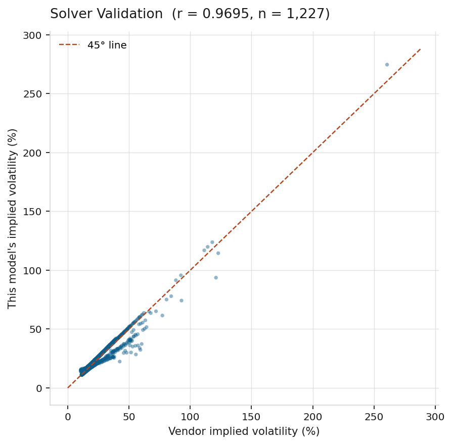
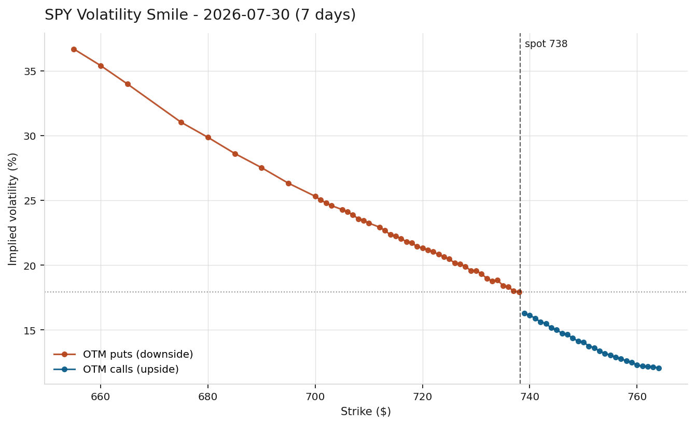
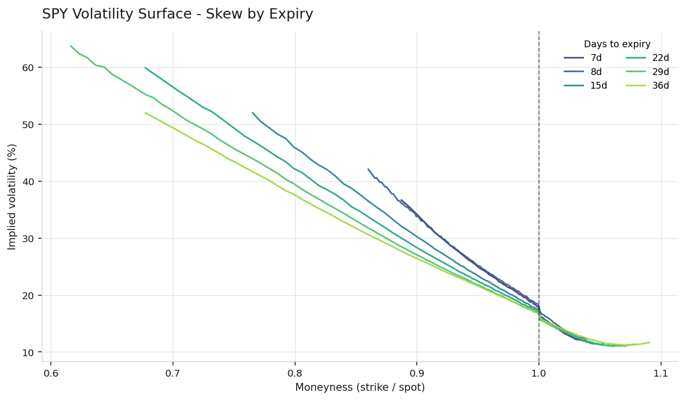

# Options Pricing & Implied Volatility Tool

Prices European options with Black-Scholes, then inverts the formula against live market quotes to extract implied volatility — and plots the result to show where the model and the market disagree.

**Stack:** Python · NumPy · SciPy · pandas · yfinance · Matplotlib
**Sample:** 1,227 SPY contracts across 6 expiries, July 2026

**The finding in one line:** Black-Scholes assumes a single volatility for the underlying. The market prices 25-delta puts at ~20% volatility and 25-delta calls at ~13% on the same stock, on the same day — a gap that widens the further out you look.

---

## 1. The mechanic

Black-Scholes takes five inputs and returns a price:

$$C = S\,N(d_1) - Ke^{-rT}N(d_2), \qquad d_1 = \frac{\ln(S/K) + (r + \sigma^2/2)T}{\sigma\sqrt{T}}, \qquad d_2 = d_1 - \sigma\sqrt{T}$$

Four inputs are observable: spot, strike, time, rate. Volatility is not — it describes the future.

So the formula gets run backwards. Given a real market price, solve for the σ that reproduces it. That number is the **implied volatility**: the market's forecast of future movement, extracted from what people are actually paying.

Validated against two independent benchmarks before touching live data:

| Check | Result |
|---|---|
| Textbook case (S=K=100, T=1, r=5%, σ=20%) | 10.4506 ✓ |
| Put-call parity, `C − P = S − Ke^(−rT)` | matches to 1e−6 ✓ |
| Round-trip (price at σ=0.27, recover σ) | 0.27000000 ✓ |

## 2. Why Brent's method, not Newton-Raphson

Newton's method finds a root by dividing by the derivative — here, **vega**. Vega collapses as options move out of the money:

| Strike (spot = 100) | Vega |
|---|---|
| 100 | 27.58 |
| 150 | 0.83 |
| 200 | 0.000474 |
| 250 | 0.000000 |

Newton divides by that. At the far strikes the step size explodes or the method fails outright — and those are exactly the strikes that make the skew interesting.

Brent's method brackets the root between two bounds and squeezes inward. It never uses the derivative, so it cannot diverge. Slower per iteration, robust everywhere it matters.

## 3. Data quality

Extracting IV from raw vendor data without filtering produces garbage. Three problems and their fixes:

- **`lastPrice` is stale.** A last trade may be hours old, struck at a different spot. Use the **mid**, `(bid + ask)/2`.
- **Penny options are rounding noise.** A contract quoted 0.01 bid / 0.02 ask has a price one tick wide; the implied vol reflects tick discretization, not a market view. Filtered at a $0.10 minimum.
- **Wide quotes have no meaningful mid.** Rejected above an 80% relative spread.

Together these dropped 236 of 1,463 contracts and pulled the tail IV range from a nonsensical 12–72% down to a coherent 12–37%.

**Validation:** implied vols computed here correlate at **r = 0.97** with the data vendor's independently published figures.



## 4. The smile



If Black-Scholes were correct, this would be a horizontal line — one volatility for one underlying. It isn't. IV falls monotonically from ~35% at deep downside strikes to ~12% on the upside.

For equity indices the curve is less a smile than a **skew**: downside protection is systematically expensive. The standard explanation is that index crashes are correlated and sudden while rallies are gradual, so the demand for portfolio insurance is one-directional and persistent. The shape is generally dated to the 1987 crash, after which flat implied-vol curves largely disappeared from index options.

## 5. Term structure of skew



Measured with 25-delta skew — the desk-standard metric, IV of the 25-delta put minus IV of the 25-delta call:

| Expiry | Days | ATM IV | 25Δ put IV | 25Δ call IV | Skew |
|---|---|---|---|---|---|
| 2026-07-30 | 7 | 16.50% | 20.48% | 14.14% | **6.34** |
| 2026-08-07 | 15 | 16.38% | 20.27% | 13.52% | **6.75** |
| 2026-08-14 | 22 | 16.09% | 20.10% | 13.12% | **6.98** |
| 2026-08-21 | 29 | 15.76% | 20.04% | 12.77% | **7.26** |
| 2026-08-28 | 36 | 15.98% | 20.19% | 12.89% | **7.30** |

Two patterns:

**Skew widens with maturity**, 6.34 → 7.30 points. Notably the put wing barely moves (20.5% → 20.2%) while the call wing sinks (14.1% → 12.9%). The widening is not investors paying up for distant crash protection — it is upside volatility getting cheaper as the horizon extends.

**ATM volatility drifts down** with maturity, a mildly downward-sloping term structure. That typically indicates near-dated event risk priced into the front expiries, decaying as the horizon lengthens.

---

## Running it

```bash
pip install -r requirements.txt
python implied_vol.py          # defaults to SPY
python implied_vol.py AAPL     # or any optionable ticker
```

Writes three charts to `charts/` and the full contract-level dataset to `implied_vols.csv`. `notebook.ipynb` walks through the derivation interactively. Data from Yahoo Finance — free, no API key.

## Method notes & limitations

- **Black-Scholes assumes European exercise.** SPY options are American and can be exercised early. For non-dividend-paying calls this rarely binds, but the put IVs carry a small bias.
- **Dividends are not modeled.** SPY yields roughly 1%, which slightly overstates call IV and understates put IV.
- **Flat risk-free rate** of 4.3%, not term-matched to each expiry. The effect on IV is second-order at these maturities but it is an approximation.
- **Quote snapshots, not synchronized trades.** Spot and option quotes are pulled milliseconds apart, and one stale leg introduces error — a real desk would use synchronized timestamps.
- **The smile is a symptom, not a model.** Fitting IV per strike documents where Black-Scholes fails; it doesn't fix it. SABR or Heston models stochastic volatility directly and is the natural next step.
